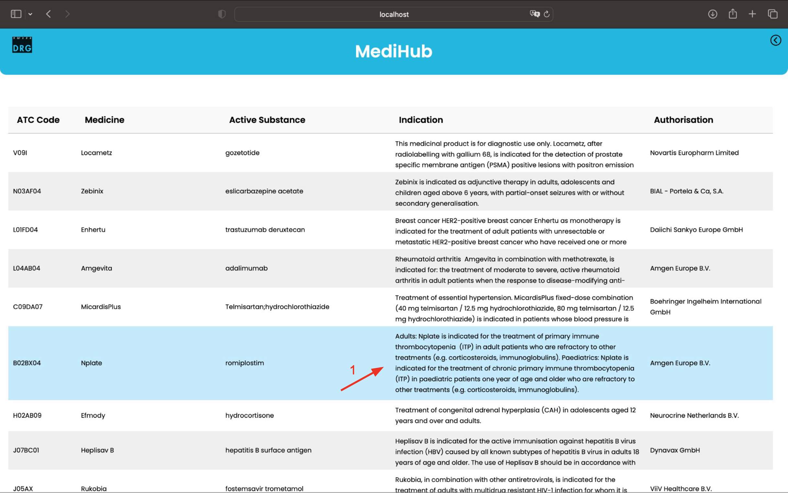
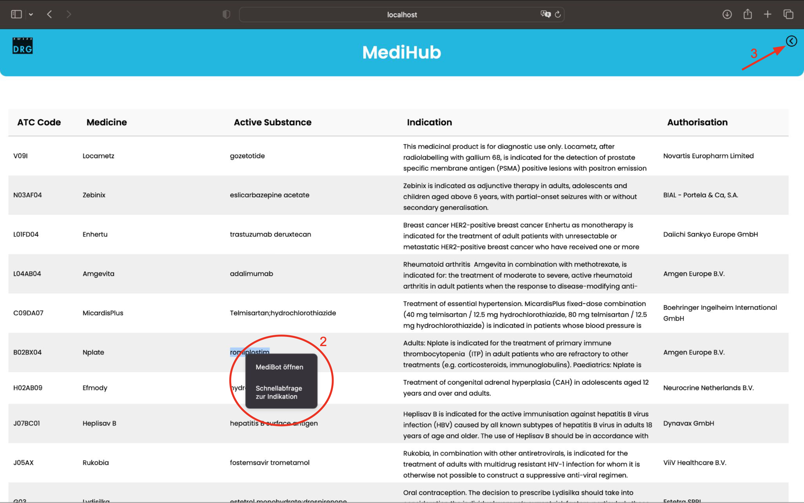
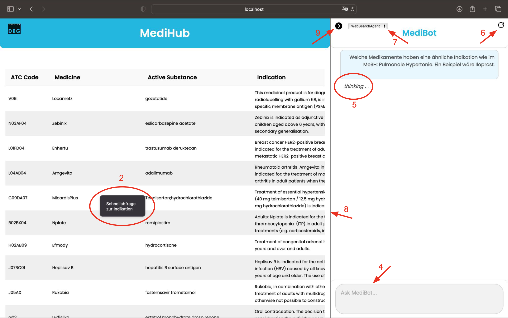

# Funktionalitäten

Dieses Dokument bietet einen Überblick über die Funktionalitäten der SwissDRG MediHub-Anwendung. Die Applikation besteht aus zwei Hauptkomponenten: dem **MediHub** zur tabellarischen Datenanzeige und dem **MediBot** zur interaktiven Abfrage medizinischer Informationen.

---

## MediHub

Das **MediHub** dient der strukturierten Visualisierung medizinischer Daten in Tabellenform.

- Die Tabelle ist scrollbar und vollständig durchsuchbar.
- Jede Tabellenzeile zeigt maximal drei Zeilen Text pro Zelle an. In der Spalte **Indikation** wird der vollständige Text bei einem ***Mouseover*** eingeblendet. `1`
- Ein **Rechtsklick** auf eine beliebige Tabellenzeile öffnet ein Kontextmenü mit zwei Optionen: `2`
  - **MediBot öffnen**: MediBot wird geöffnet (nur sichtbar, falls MediBot geschlossen)
  - **Schnellabfrage zur Indikation**: MediBot wird geöffnet und folgende Standardfrage wird gestellt:
  *Welche Medikamente haben die gleiche Indikation wie {Medikamentenname aus entsprechender Zeile}?*
  > Die Standardfrage und übermittelte Infromation aus der Zeile kann selbst konfiguriert werden, siehe [Handbuch](./Handbuch.md)
- Zusätzlich kann der MediBot jederzeit über den **Pfeil-Button oben rechts** geöffnet werden. `3`

---

## MediBot

Der **MediBot** ist ein Chatbot, der Fragen zu Medikamenten oder Indikationen beantwortet.

- Nutzer:innen geben ihre Frage im Texteingabefeld ein und senden sie mit der **Enter-Taste** ab. `4`
- Während der Anfrageverarbeitung zeigt der Bot eine **"thinking"** Animation. `5`
- Der **vollständige Chatverlauf wird gespeichert** und bei jeder neuen Nachricht im Backend automatisch an das jewelige Modell übergeben, damit auch **Rückfragen** beantwortet werden können.
- Der Verlauf kann über den **Reset-Button oben rechts** zurückgesetzt werden. `6`
- Über ein **Dropdown-Menü** kann das gewünschte Modell für die Antwort ausgewählt werden.
  Das Modell kann innerhalb eines bestehenden Chats problemlos gewechslt werden.
  Es zählt die Modellauswahl **zum Zeitpunkt des Abschickens** einer Nachricht und nicht Auswahl zu Beginn der Nachrichtenerfassung. `7`

### Verfügbare Agenten

| Agent-Name          | Beschreibung                                                        |
| ------------------- | ------------------------------------------------------------------- |
| **WebSearchAgent**  | Nutzt die OpenAI WebSearch-Funktionalität über das offizielle SDK.  |
| **FileSearchAgent** | Durchsucht zuvor hochgeladene Tabellendaten (via Vector Store).     |
| **WebSearchGPT**    | Nutzt das neue `gpt-4o-mini-search-preview`- Modell mit Webzugriff  |
| **UnionAgent**      | Kombiniert die Ergebnisse von WebSearch und FileSearch.             |
| **GPT**             | Reines OpenAI-Modell ohne Suche, basiert aktuell auf `gpt-4o-mini`. |

> Hinweis: Bei Schnellabfragen aus dem MediHub wird automatisch der **WebSearchAgent** verwendet.  
> Auch beim regulären Öffnen des MediBot ist dieser Agent standardmäßig vorausgewählt.

- Die Grösse des MediBots kann dynamisch geändert werden. Hierzu verschiebt man die Trennlinie mit der Maus an die gewünschte Stelle. `8`
> Der MediBot nimmt dabei **mindestens 30% und maximal 65%** der Gesamtbreite ein. Die Tabelle im MediHub hat eine feste Grösse und passt sich nicht an. Stattdessen kann man im MediHub horizontal scrollen.
- Der MediBot kann über den **Pfeil-Button oben links** wieder geschlossen werden. `9`

---

# Hinweise zur Benutzung der Applikation

Im Backend wird der **gesamte Chatverlauf** gespeichert und bei jeder Anfrage an das jeweilige Modell als zusätzlichen Kontext übergeben.  

Je größer der Chatverlauf ist, desto länger kann die Antwortdauer werden – zudem können die API-Kosten bei OpenAI pro Abfrage steigen.
Wir empfehlen daher, den Verlauf regelmäßig zurückzusetzen (z.B. alle paar Tage), um diese Effekte zu vermeiden.

> Beim **Neustart der gesamten Applikation** (z.B. via Docker-Compose) wird der Verlauf automatisch gelöscht.  
> Ein **Seiten-Refresh im Frontend** löscht den Verlauf im Backend **nicht**  – er ist dort weiterhin gespeichert, auch wenn er im UI nicht mehr sichtbar ist.

**Wichtig:**  
Der Inhalt und die Struktur der Antwort des jedeiligen Modells/Agenten hängt stark von den Instruktionen/System-Prompts im Backend ab.

Momentan sind der FileSearchAgent, WebSearchAgent und UnionAgent so instruiert, 
dass sie möglichst "sinvoll" die Frage nach Medikamenten mit ähnlicher Indikation beantworten können (WebSearchGPT und GPT bearbeiten die User-Frage **ohne** zusätzliche Anweisungen).
Diese Instruktionen führen aber dazu, dass sich diese drei Modelle **nicht** gut für Rückfragen zu bisherigen Nachrichten eignen.
Stattdessen sollte man für Rückfragen auf WebSearchGPT oder GPT wechseln.

> Es empfiehlt sich zu evaluieren, welche Form der Antwort erwünscht ist, inhaltlich so wie auch strukturell. 
> Anschliessend können basierend darauf die Instruktionen 
> der Agenten im Backend angepasst werden (Siehe dazu [Handbuch](./Handbuch.md)).

Der UnionAgent kombiniert die Antwort des FileSearchAgents und WebSearchAgents, in dem er die Union der beiden Antworten ausgibt.
Dies ergibt aber hautpsächlich im Kontext der Frage nach Medikamenten mit ähnlicher Indikaion Sinn. 
Für andere Fragen sollte man ein anders Modell wählen oder die Instruktionen im Backend anpassen. 

## Geschätzte Anfragekosten & Antwortzeiten

Die folgende Tabelle zeigt beispielhafte Werte für eine Standard-Indikationsabfrage bei **leerem Chatverlauf**.  
Diese Werte dienen der Orientierung – tatsächliche Werte können je nach Systemauslastung, Modell-Updates oder Preisanpassungen durch OpenAI abweichen.

| Modell          | Antwortdauer (s) | API-Kosten (USD) |
| --------------- | ---------------- | ---------------- |
| WebSearchAgent  | 20-30            | ≈ 0.04           |
| FileSearchAgent | 15-30            | ≈ 0.04           |
| WebSearchGPT    | 20-30            | ≈ 0.05           |
| UnionAgent      | 30-60            | ≈ 0.09           |
| GPT             | 15-25            | ≈ 0.01           |

> **Hinweis**: Die tatsächlichen Kosten hängen vom verwendeten OpenAI-Modell, der Tokenanzahl und den aktuellen Preisen von OpenAI ab.  
> Antworddauer kann Variationen unterliegen und wird von Kontextgrösse und Komplexität der Abfrage beeinflusst.

---