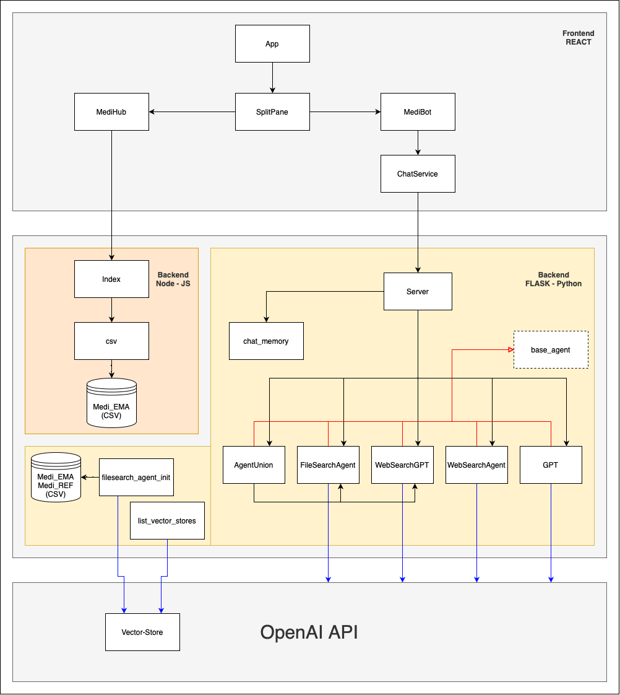

# SwissDRG Handbuch

Dieses Dokument bietet einen technischen Überblick über die SwissDRG MediHub-Applikation.  
Ziel ist es, zentrale Codestellen und Konzepte zu erläutern, damit Entwickler:innen von SwissDRG bei Bedarf selbst Anpassungen vornehmen oder die Anwendung gezielt weiterentwickeln können.

Es werden ausserdem Hinweise zur Erweiterbarkeit und zu externen Ressourcen gegeben, beispielsweise für das Tracking von OpenAI-Abfragen.

---

## Inhalte

Frontend:
1. **Schnellabfrage**  
Wie kann die Schnellabfrage modifiziert werden?

Backend: 
1. **MediHub CSV-Tabelle (core-server)**  
Wie kann die Tabelle im MediHub geändert werden?
2. **Neues File für den filesearch_agent hochladen**  
Wie können andere oder neue Files für den FileSearchAgent hochgeladen werden?
3. **Agentenarchitektur im ChatBot-Backend (Flask)**  
Wie funktionieren die Agenten und wie kann ich diese anpassen?

Ressourcen:
1. **OpenAI API Vector-Store Übersicht**
2. **Projektübersicht: Grafische Übersicht über die Entitäten/Komponenten der Applikation**


## Frontend

### 1. Schnellabfrage
Das MediHub bietet über ein Rechtsklick-Kontextmenü eine Schnellanfrage ab, welche angepasst werden kann.

```js
// Zeile 18
const columns = tableData.length > 0 ? Object.keys(tableData[0]) : []; // Spaltennamen aus den Daten
// medi_EMA: ATC Code, Medicine, Active Substance, Indication, Authorisation
...
// Zeile 58
const handleQuickQuestion = () => {
  const content = `Welche Medikamente haben die gleiche Indikation wie ${selectedRow.Medicine}?`;
  onOpenChatbot(content);
  closeContextMenu();
};
...
// Zeile 161
<button onClick={handleQuickQuestion}>Schnellabfrage zur Indikation</button>
```

Zeile 161 spezifiziert die Option im **Kontextmenü**. In Zeile 58 kann dann über `content` die Frage definiert werden, die anschliessend an den MediBot gesendet wird. Dabei lassen sich beliebige Informationen aus der Zeile verarbeiten, in der das Kontextmenü geöffnet wurde. Die Variable `columns` in Zeile 18 speichert die Spaltennamen der Tabelle, und mit `selectedRow.{#someColumn}` kann der jeweilige Eintrag ausgewählt werden. Selbstverständlich können auch weitere Schnellfragen ergänzt werden. Füge dazu einfach einen neuen Button im Kontextmenü hinzu und lege die Aktion über `onClick={#handleNewOption}` fest.  

---

## Backend

### 1. MediHub CSV-Tabelle (core-server)

Im Ordner `core-server/` gibt es zwei wichtige Unterverzeichnisse:

- **data/**
  Hier legst du deine CSV-Datei ab, die im Frontend als Tabelle angezeigt werden soll. Standarddatei ist `medi_EMA.csv` (Tabelle der European Medicines Agency). Wenn du eine neue Tabelle verwenden willst, benenne deine Datei z.B. `medi_NEU.csv` und lege sie in diesen Ordner ab.

- **routes/csv.js**
  Diese Datei liest die CSV aus dem `data/`-Ordner und liefert sie als JSON für das Frontend.

#### Schritte zum Wechseln der Tabelle

1. **Neue CSV-Datei hochladen**  
   Lege deine neue Tabelle unter `core-server/data/` ab. Beispiel:  
   ```
   core-server/
   ├─ data/
   │  └─ medi_NEU.csv
   └─ routes/
      └─ csv.js
   ```
   Die Tabelle `medi_NEU.csv` sollte als erste Zeile die Spaltennamen enthalten.

2. **Pfad in `csv.js` anpassen**  
   Öffne `core-server/routes/csv.js` und ändere in Zeile 8 den Dateinamen:
   ```diff
   - const csvFile = fs.readFileSync('./data/medi_EMA.csv', 'utf8');
   + const csvFile = fs.readFileSync('./data/medi_NEU.csv', 'utf8');
   ```

---


### 2. Neues File für den filesearch_agent hochladen


- **Verzeichnis**: `config_fileSearch/`  
- **Dateien**:  
  - `filesearch_agent_init.py`  
  - `list_vector_stores.py`  

**Zweck**  
Mit `filesearch_agent_init.py` legst du einen neuen Vector Store in OpenAI an und lädst deine JSON-Dateien hoch. Die erzeugte File-ID wird automatisch in der Umgebungsvariable `.env` gespeichert.


##### Schritt 1: Dateien ins `data/`-Verzeichnis legen

Lege deine neuen Daten-Dateien im Hauptverzeichnis unter `data/` ab. Beispiel:

```
project-root/
├─ backend/
├─ chatBot/
├─ config_fileSearch/
├─ data/
│  ├─ medi_EMA.json
│  ├─ medi_REF.json
│  └─ medi_NEU.json   # <– Deine neue Datei
```

##### Schritt 2: `filesearch_agent_init.py` anpassen

Öffne `config_fileSearch/filesearch_agent_init.py` und ergänze den Pfad zu deinen Dateien in der Liste `JSON_PATHS`:

```diff
-   JSON_PATHS = [
-       str(pathlib.Path(__file__).parent.parent / "data" / "medi_EMA.json"),
-       str(pathlib.Path(__file__).parent.parent / "data" / "medi_REF.json"),
-   ]
+   JSON_PATHS = [
+       str(pathlib.Path(__file__).parent.parent / "data" / "medi_EMA.json"),
+       str(pathlib.Path(__file__).parent.parent / "data" / "medi_REF.json"),
+       str(pathlib.Path(__file__).parent.parent / "data" / "medi_NEU.json"),  # <– Deine neue Datei
+   ]
```

Speichere die Änderung.


##### Schritt 3: Vector Store initialisieren

Führe das Skript aus, um die Dateien hochzuladen und einen neuen Vector Store zu erstellen:

```bash
cd backend/chatBot/config_fileSearch
python3 filesearch_agent_init.py
```

- Das Skript gibt den Upload-Status und das Dateivolumen aus.  
- Anschliessend wird die neue `FILE_ID` in der Umgebungsvariable `.env` aktualisiert.


##### Schritt 4: Vorhandene Vektor-Stores anzeigen (optional)

Falls du überprüfen möchtest, welche Stores vorhanden sind, führe aus:

```bash
python list_vector_stores.py
```

Du erhältst eine Liste mit Name, ID, Erstellungsdatum und Status.
Mit `delete_all = True` in Zeile `54` können angelegte Vector-Stores gelöscht werden.

---

### 3. Agentenarchitektur im ChatBot-Backend (Flask)

Die gesamte Logik für die KI-Agenten steckt in `chatBot/bots/`. Dort gibt es mehrere Agenten-Klassen, die du nach Bedarf anpassen oder erweitern kannst.

#### 3.1 FileSearchAgent

- **Datei**: `chatBot/bots/filesearch_agent.py`  
- **Aufgabe**: Suche in einem OpenAI-Vector-Store (JSON-Daten).

**Abhängigkeit**  
Eine Datei (`.json`) muss bereits via `filesearch_agent_init.py` in den Vector Store geladen sein.

**Prompt anpassen**  
Öffne `filesearch_agent.py` und ändere den Text zwischen Zeile 22 und 28:

```diff
-    self.agent = Agent(
-        name="FileSearchAgent",
-        instructions=(
-            "You are a pharmacology specialist. …"
-        ),
-        tools=[ … ],
-    )
+    self.agent = Agent(
+        name="FileSearchAgent",
+        instructions=(
+            "NEUER PROMPT HIER IN ANFÜHRUNGSZEICHEN EINFÜGEN."
+        ),
+        tools=[ … ],
+    )
```

**Ergebnisanzahl steuern**  
Auf Zeile 31 lässt sich `max_num_results` anpassen:

```diff
 FileSearchTool(
-    max_num_results=30,  # Wert nach Bedarf ändern
+    max_num_results=30,  # <– hier ändern
     vector_store_ids=[FILE_ID],
     include_search_results=True,
 ),
```

> Hinweis: Mehr Ergebnisse verlängern die Antwortzeit und beanspruchen höhere Token-Limits.

---

#### 3.2 WebSearchAgent

- **Datei**: `chatBot/bots/websearch_agent.py`  
- **Aufgabe**: Web-Suche via `WebSearchTool`, um Evidenz zu ATC-Codes etc. zu finden.

**Prompt anpassen**  
In `websearch_agent.py` findest du bei Zeile 23 ff. die `instructions`. Tausche den Text in den Klammern gegen deine eigene Vorgabe:

```diff
-    self.agent = SDKAgent(
-        name="WebSearchAgent",
-        instructions=(
-            "You are a clinical pharmacologist. …"
-        ),
+    self.agent = SDKAgent(
+        name="WebSearchAgent",
+        instructions=(
+            "DEIN NEUER WEBSEARCH-PROMPT HIER."
+        ),
```

---

#### 3.3 WebSearchGPT Agent

- **Datei**: `chatBot/bots/websearch_gpt.py`  
- **Aufgabe**: Chat mit GPT inklusive Web-Suche (Modell `gpt-4o-mini-search-preview`).

**Modell wechseln**  
In `run()` wird aktuell das Modell `gpt-4o-mini-search-preview` genutzt. Ersetze es bei Zeile 41:

```diff
-    response = self.client.chat.completions.create(
-        model="gpt-4o-mini-search-preview",
+    response = self.client.chat.completions.create(
+        model="DEIN_NEUES_MODELL",
```

---

#### 3.4 GPT Agent

- **Datei**: `chatBot/bots/gpt.py`  
- **Aufgabe**: Generischer GPT-Chat mit variablem Modell.

**Modell anpassen**  
Im Konstruktor auf Zeile 14 (`__init__`) wird standardmässig `model="o4-mini"` übergeben. Das kannst du bei Bedarf ändern:

```diff
-   def __init__(self, model: str = "o4-mini"):
-       openai.api_key = os.getenv("OPENAI_API_KEY")
-       self.model = model
+   def __init__(self, model: str = "DEIN_NEUES_MODELL"):
+       openai.api_key = os.getenv("OPENAI_API_KEY")
+       self.model = model

```
---

#### 3.5 AgentUnion

- **Datei**: `chatBot/bots/agent_union.py`  
- **Aufgabe**: Kombiniert FileSearchAgent, WebSearchAgent und GPT.

**Endprompt anpassen**  
Öffne `agent_union.py` und passe den Deduplication-Prompt in Zeile 42 ff. an:

```diff
-       dedupe_prompt = (
-           "You are a medical assistant. I have sent you multiple lists of medications with ATC codes:\n\n"
-           "```\n{combined}\n```\n\n"
-           "Please remove all duplicates and format the output so that each line starts with the ATC code, "
-           "followed by a tab or dash, then the medication name. Return only the structured list without any further explanation."
-       )
+       dedupe_prompt = (
+           "DEIN_NEUER_DEDUPLICATION-PROMPT_HIER."
+       )
```
---

## Ressourcen

### 1. OpenAI API Vecotor-Store Übersicht
Die hochgeladenen Files und erstellten Vector-Stores können unter folgenden Link nachgeschaut werden:
https://platform.openai.com/storage/files

Alternativ kann das Skript `backend/chatBot/config_fileSearch/list_vector_stores.py` ausgeführt werden. 
Mit `delete_all = True` in Zeile `54` können angelegte Vector-Stores gelöscht werden.

### 2. Projektübersicht: Grafische Übersicht über die Entitäten/Komponenten der Applikation

Diese Übersicht dient dazu, einen Einblick ins Projekt zu bekommen und die Beziehungen der einzelnen Entitäten/Komponenten/Files zu verstehen.
