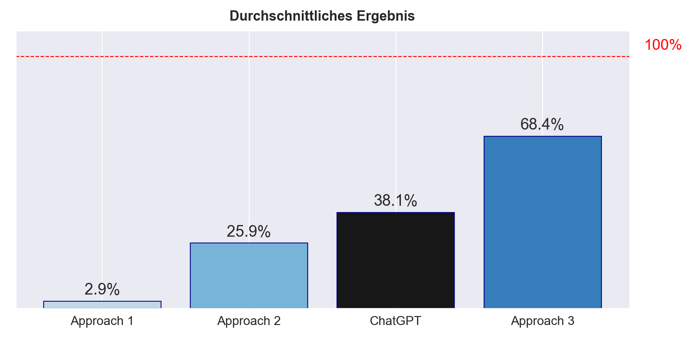
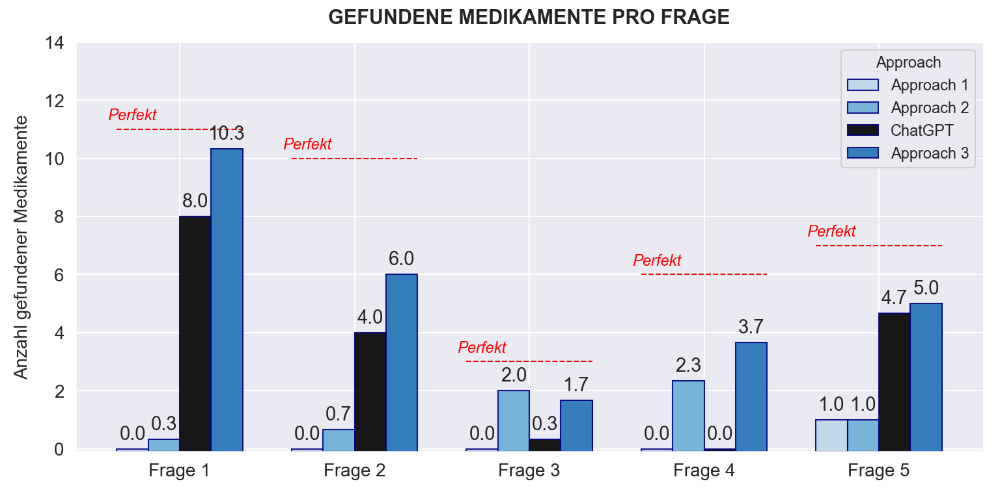
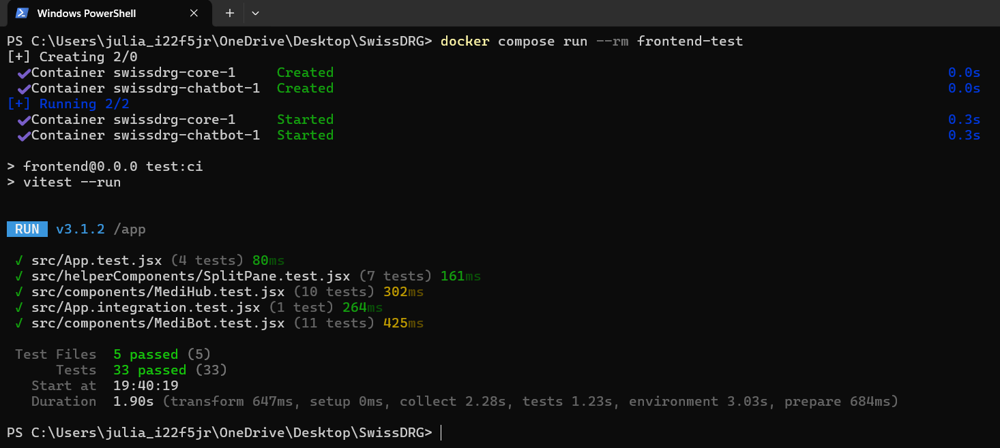

# Testresultate

In diesem Dokument möchten wir unsere Testresultate vorstellen. Die ersten beiden Grafiken zeigen, wie gut unsere verschiedenen LLM-Ansätze in den Back-End-Tests abgeschnitten haben. Dafür haben wir unseren verschiedenen Approaches identische Beispiel-Fragen gestellt und geprüft, ob sie die von Christian erwarteten Medikamente korrekt ausgeben.

Die dritte Grafik zeigt, dass unsere Frontend-Tests erfolgreich durchgelaufen sind. Diese Tests wurden mit der React Testing Library durchgeführt und decken sowohl einzelne Komponenten als auch komplette Funktionalitäten ab. Alle Tests sind dockerisiert und lassen sich automatisiert ausführen.

Zur Erklärung der Approaches:  
**Approach 1:** In diesem Approach wird die Medikamententabelle in kleinen Stücken an ChatGPT gesendet.  
**Approach 2:** In diesem Approach wurde Vektorisierung der Indikationen und ATC-Codes verwendet, um die Ähnlichkeit von Medikamenten zu schätzen.  
**Approach 3:** In diesem Approach kommt die neue Agents API von OpenAI zum Einsatz. Es wird ein Agent angefragt, der sowohl File-Search als auch Web-Search ausführt.

---

## Grafik 1: Durchschnittlich erkannte Medikamente

Diese Grafik zeigt die durchschnittliche Anzahl korrekt erkannter Medikamente für die drei getesteten LLM-Approaches. ChatGPT 4o-mini dient dabei als Benchmark. Bewertet wurde, wie viele der von Christian erwarteten Medikamente pro Frage im Output enthalten waren.

- Der schwarze Balken steht für **ChatGPT 4o-mini**, unser Referenzmodell.
- Die anderen drei Ansätze bauen auf diesem Modell auf.
- Wie es die SwissDRG gewünscht hat, lag der Fokus auf einer hohen **Trefferquote** – relevante Medikamente sollten möglichst vollständig erkannt werden; falsch-positive Treffer waren zweitrangig.
- Die rote Linie markiert die theoretisch maximal erreichbare Trefferquote von **100 %**.

---

## Grafik 2: Ergebnisse pro Frage

Diese Grafik zeigt dasselbe wie Grafik 1, allerdings sind die Genauigkeiten nach Frage aufgeschlüsselt.

- Die gestrichelten roten Linien zeigen die maximal erreichbare Trefferanzahl.
- Um dies zu erreichen, hätten die Approaches jedes Medikament in jedem einzelnen Durchgang finden müssen.
- Auch hier dient **ChatGPT 4o-mini** als Benchmark (schwarzer Balken).

---

## Grafik 3: Erfolgreicher Frontend-Testlauf

Der Screenshot zeigt einen vollständigen Testlauf unseres Frontends:

- Durchgeführt wurden **Unit-Tests**, **Integrationstests** und **Feature-Tests** mit der React Testing Library.
- Es wurden sowohl einzelne Komponenten als auch ganze Funktionalitäten (z. B. der Reload-Button) geprüft.
- Die Tests sind vollständig **dockerisiert** und können mit einem einzigen Befehl automatisiert ausgeführt werden.

---

## Fazit

Die getesteten LLM-Approaches konnten anfangs nur sehr wenig leisten, schlussendlich jedoch einen Grossteil der relevanten Medikamente identifizieren – Approach 3 war sogar besser als unser Benchmark. Parallel wurde das Frontend erfolgreich getestet und läuft zuverlässig sowohl lokal als auch in der Docker-Umgebung.
